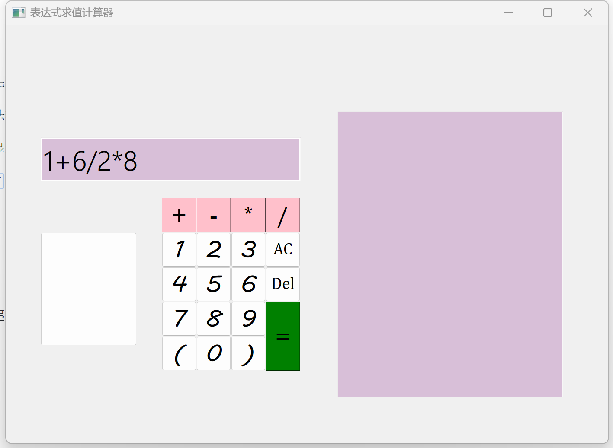
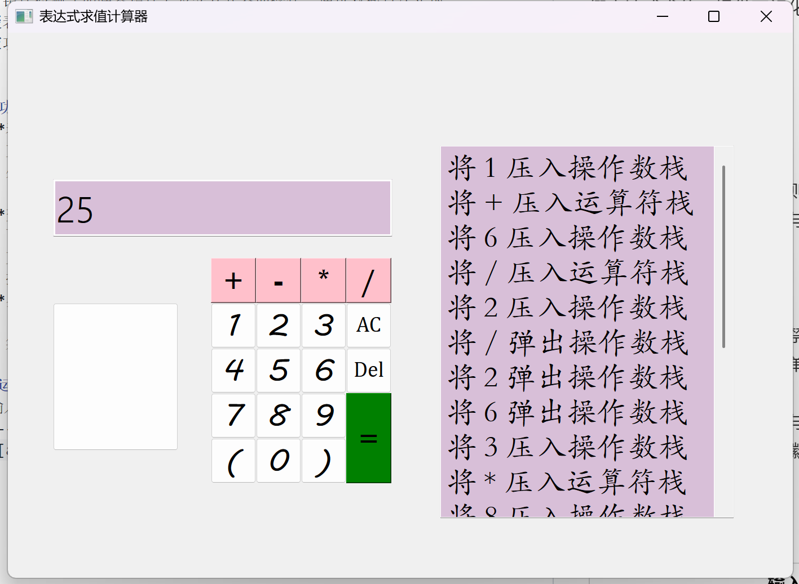

# Expression-evaluation-calculator
一个基于Qt框架实现的表达式求值计算器，支持四则运算、浮点数计算、错误检测（如除零错误）及交互式界面操作。通过双栈算法实现中缀表达式求值，提供可视化计算过程和结果展示，支持字符删除与清空功能。

## 功能特性
- **表达式求值**  
  - 支持加减乘除四则运算（含括号优先级）
  - 处理浮点数运算与整数混合表达式
  - 自动检测并报错（如除零错误、非法输入）
- **交互界面**  
  - 可视化计算过程（右侧文本框动态显示栈操作）
  - 支持按键输入（禁用键盘直接输入）
  - 提供`Del`（删除单个字符）和`AC`（清空）功能
- **界面设计**  
  - 自定义按钮颜色与背景样式

## 运行截图
| 输入界面 | 计算过程演示 |
|----------|--------------|
|  ||

## 快速开始
在`Expression-evaluation-calculator\表达式求值计算器`目录下找到`qiuzhi.exe`可执行文件,双击运行即可

